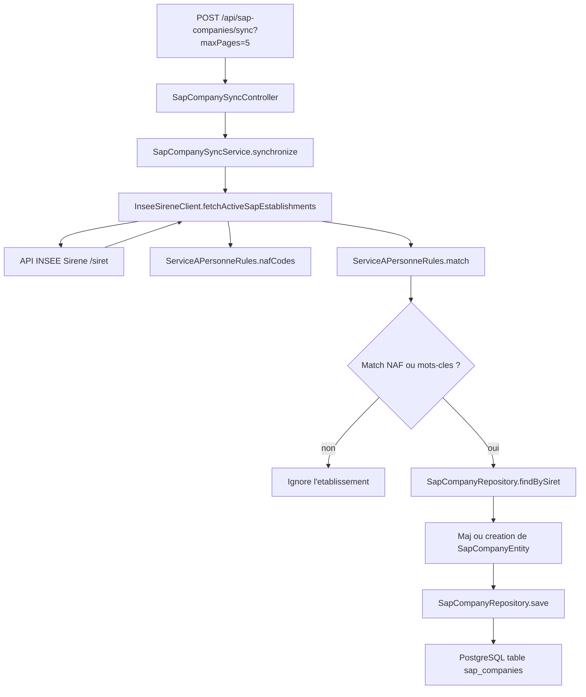

# Flux de recuperation et de persistence SAP

Ce document decrit le chemin complet suivi quand on lance la synchronisation des entreprises INSEE vers la base PostgreSQL.



## Etapes principales

1. Le endpoint REST recoit la demande de synchronisation.
  Fichiers impliques:
  - [src/main/java/com/myspacesante/insee/web/SapCompanySyncController.java](../src/main/java/com/myspacesante/insee/web/SapCompanySyncController.java)
  - [src/main/java/com/myspacesante/insee/service/SapCompanySyncService.java](../src/main/java/com/myspacesante/insee/service/SapCompanySyncService.java)

2. Le service lance la recuperation des etablissements actifs a partir des codes NAF SAP.
  Fichiers impliques:
  - [src/main/java/com/myspacesante/insee/service/SapCompanySyncService.java](../src/main/java/com/myspacesante/insee/service/SapCompanySyncService.java)
  - [src/main/java/com/myspacesante/insee/service/ServiceAPersonneRules.java](../src/main/java/com/myspacesante/insee/service/ServiceAPersonneRules.java)
  - [src/main/java/com/myspacesante/insee/service/InseeSireneClient.java](../src/main/java/com/myspacesante/insee/service/InseeSireneClient.java)
  - [src/main/java/com/myspacesante/insee/config/InseeApiProperties.java](../src/main/java/com/myspacesante/insee/config/InseeApiProperties.java)
  - [src/main/resources/application.yml](../src/main/resources/application.yml)
  - [../.env](../.env)

3. Le client INSEE construit l'URL de recherche et appelle l'API Sirene avec le header d'authentification.
  Fichiers impliques:
  - [src/main/java/com/myspacesante/insee/service/InseeSireneClient.java](../src/main/java/com/myspacesante/insee/service/InseeSireneClient.java)
  - [src/main/java/com/myspacesante/insee/config/RestClientConfig.java](../src/main/java/com/myspacesante/insee/config/RestClientConfig.java)
  - [src/main/resources/application.yml](../src/main/resources/application.yml)
  - [../.env](../.env)

4. Chaque resultat recupere est controle par les regles metier pour garder essentiellement les entreprises de services a la personne.
  Fichiers impliques:
  - [src/main/java/com/myspacesante/insee/service/SapCompanySyncService.java](../src/main/java/com/myspacesante/insee/service/SapCompanySyncService.java)
  - [src/main/java/com/myspacesante/insee/service/ServiceAPersonneRules.java](../src/main/java/com/myspacesante/insee/service/ServiceAPersonneRules.java)

5. Si le resultat matche, le backend prepare l'entite, met a jour ses champs et la sauve par SIRET.
  Fichiers impliques:
  - [src/main/java/com/myspacesante/insee/service/SapCompanySyncService.java](../src/main/java/com/myspacesante/insee/service/SapCompanySyncService.java)
  - [src/main/java/com/myspacesante/insee/model/SapCompanyEntity.java](../src/main/java/com/myspacesante/insee/model/SapCompanyEntity.java)
  - [src/main/java/com/myspacesante/insee/repository/SapCompanyRepository.java](../src/main/java/com/myspacesante/insee/repository/SapCompanyRepository.java)

6. L'enregistrement est persiste dans PostgreSQL avec la date de synchro et le payload brut pour audit ou debug.
  Fichiers impliques:
  - [src/main/java/com/myspacesante/insee/model/SapCompanyEntity.java](../src/main/java/com/myspacesante/insee/model/SapCompanyEntity.java)
  - [src/main/java/com/myspacesante/insee/repository/SapCompanyRepository.java](../src/main/java/com/myspacesante/insee/repository/SapCompanyRepository.java)
  - [src/main/java/com/myspacesante/insee/service/SapCompanySyncService.java](../src/main/java/com/myspacesante/insee/service/SapCompanySyncService.java)

## Description textuelle detaillee

La synchronisation commence dans [SapCompanySyncController.java](../src/main/java/com/myspacesante/insee/web/SapCompanySyncController.java), qui expose le endpoint `POST /api/sap-companies/sync`.

Le controleur transmet ensuite la demande a [SapCompanySyncService.java](../src/main/java/com/myspacesante/insee/service/SapCompanySyncService.java). Ce service orchestre tout le cycle de recuperation, de filtrage et de persistence.

[SapCompanySyncService.java](../src/main/java/com/myspacesante/insee/service/SapCompanySyncService.java) appelle [InseeSireneClient.java](../src/main/java/com/myspacesante/insee/service/InseeSireneClient.java) pour interroger l'API Sirene. Les parametres d'appel viennent de [InseeApiProperties.java](../src/main/java/com/myspacesante/insee/config/InseeApiProperties.java), eux-memes alimentes par [application.yml](../src/main/resources/application.yml) et par le fichier local [.. /.env](../.env).

[InseeSireneClient.java](../src/main/java/com/myspacesante/insee/service/InseeSireneClient.java) construit la requete de recherche, puis [RestClientConfig.java](../src/main/java/com/myspacesante/insee/config/RestClientConfig.java) injecte automatiquement le header `X-INSEE-Api-Key-Integration` avec la valeur de `INSEE_API_KEY`.

Une fois les donnees recuperees, [ServiceAPersonneRules.java](../src/main/java/com/myspacesante/insee/service/ServiceAPersonneRules.java) applique le filtrage metier. Le code ne conserve une entreprise que si elle correspond a un code NAF SAP ou a des mots-cles representant une activite de services a la personne.

Quand un resultat passe ce filtre, [SapCompanySyncService.java](../src/main/java/com/myspacesante/insee/service/SapCompanySyncService.java) remplit [SapCompanyEntity.java](../src/main/java/com/myspacesante/insee/model/SapCompanyEntity.java) avec les champs utiles, puis [SapCompanyRepository.java](../src/main/java/com/myspacesante/insee/repository/SapCompanyRepository.java) enregistre ou met a jour la ligne via le SIRET.

Enfin, PostgreSQL conserve l'entite finale avec les informations de synchro, les marqueurs de filtrage et le JSON brut de l'API pour pouvoir auditer ou rejouer la logique plus tard.

## Fichiers qui interviennent

- [src/main/java/com/myspacesante/insee/web/SapCompanySyncController.java](../src/main/java/com/myspacesante/insee/web/SapCompanySyncController.java)
- [src/main/java/com/myspacesante/insee/service/SapCompanySyncService.java](../src/main/java/com/myspacesante/insee/service/SapCompanySyncService.java)
- [src/main/java/com/myspacesante/insee/service/InseeSireneClient.java](../src/main/java/com/myspacesante/insee/service/InseeSireneClient.java)
- [src/main/java/com/myspacesante/insee/service/ServiceAPersonneRules.java](../src/main/java/com/myspacesante/insee/service/ServiceAPersonneRules.java)
- [src/main/java/com/myspacesante/insee/repository/SapCompanyRepository.java](../src/main/java/com/myspacesante/insee/repository/SapCompanyRepository.java)
- [src/main/java/com/myspacesante/insee/model/SapCompanyEntity.java](../src/main/java/com/myspacesante/insee/model/SapCompanyEntity.java)
- [src/main/java/com/myspacesante/insee/config/RestClientConfig.java](../src/main/java/com/myspacesante/insee/config/RestClientConfig.java)
- [src/main/java/com/myspacesante/insee/config/InseeApiProperties.java](../src/main/java/com/myspacesante/insee/config/InseeApiProperties.java)
- [src/main/resources/application.yml](../src/main/resources/application.yml)
- [.env](../.env)

## Commande de lancement

```bash
mvn spring-boot:run
```

## Commande de synchronisation

```bash
curl -X POST "http://localhost:8080/api/sap-companies/sync?maxPages=5"
```
